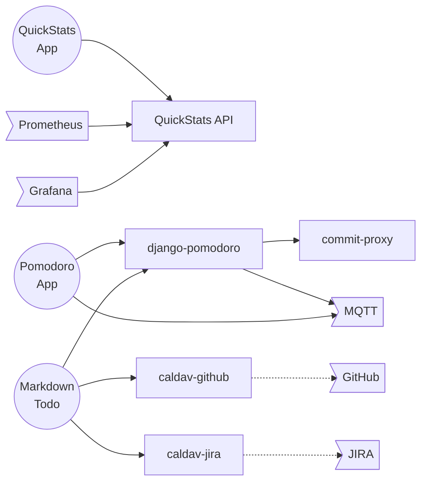

```mermaid
graph LR

ios-pomodoro((<center>Pomodoro<br>App</center>))
ios-quickstats((<center>QuickStats<br>App</center>))
ios-todo((<center>Markdown<br>Todo</center>))
mqtt>MQTT]
grafana>Grafana]
prometheus>Prometheus]
github>GitHub]
jira>JIRA]

quickstats-django[QuickStats API]

caldav-github-.->github
caldav-jira-.->jira
django-pomodoro-->commit-proxy
django-pomodoro-->mqtt
ios-pomodoro-->django-pomodoro
ios-pomodoro-->mqtt
ios-quickstats-->quickstats-django
ios-todo-->caldav-github
ios-todo-->caldav-jira
ios-todo-->django-pomodoro

prometheus-->quickstats-django
grafana-->quickstats-django


click ios-pomodoro "https://github.com/kfdm/ios-pomodoro"
click ios-quickstats "https://github.com/quickstats/ios-quickstats"
click mqtt "https://ideas.paultraylor.dev/tags/mqtt"
click quickstats-django "https://github.com/quickstats/quickstats-django"
click commit-proxy "https://github.com/kfdm/commit-proxy"
click github "https://developer.github.com/v3/"
click jira "https://developer.atlassian.com/cloud/jira/platform/rest/v3/"
click prometheus "https://prometheus.io"
click grafana "https://grafana.net"

class ios-pomodoro personal-project
class ios-quickstats personal-project
class quickstats-django personal-project
```
