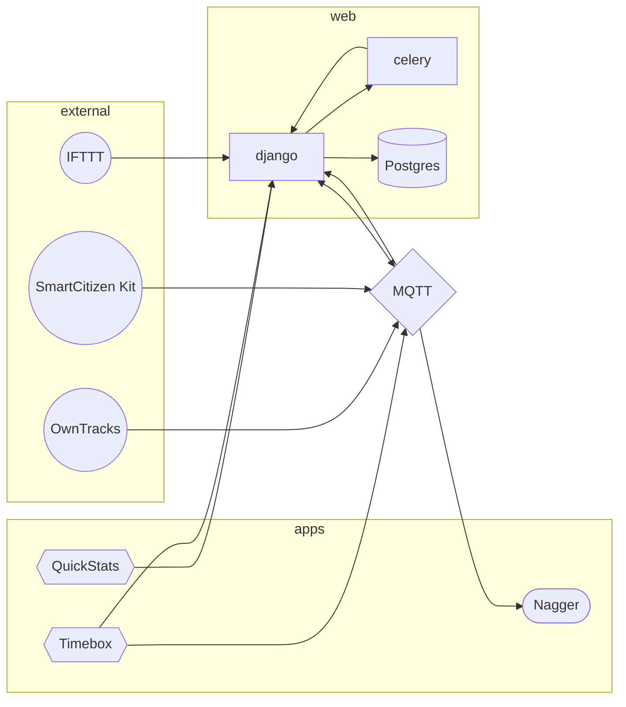

```mermaid
graph LR

subgraph external
    ifttt((IFTTT))
    owntracks((OwnTracks))
    smartcitizen((SmartCitizen Kit))
end

subgraph apps
    timebox{{Timebox}}
    quickstats{{QuickStats}}
    nagger([Nagger])
end

subgraph web
    django
    celery
    db
end

db[(Postgres)]
mqtt{ MQTT }

celery --> django
django --> celery
django --> db
django <--> mqtt
ifttt --> django
mqtt --> django
mqtt --> nagger
owntracks --> mqtt
quickstats --> django
smartcitizen --> mqtt
timebox --> django
timebox --> mqtt


click owntracks "https://owntracks.org/booklet/"
click smartcitizen "https://smartcitizen.me/"
click ifttt "https://ifttt.com/"
```
