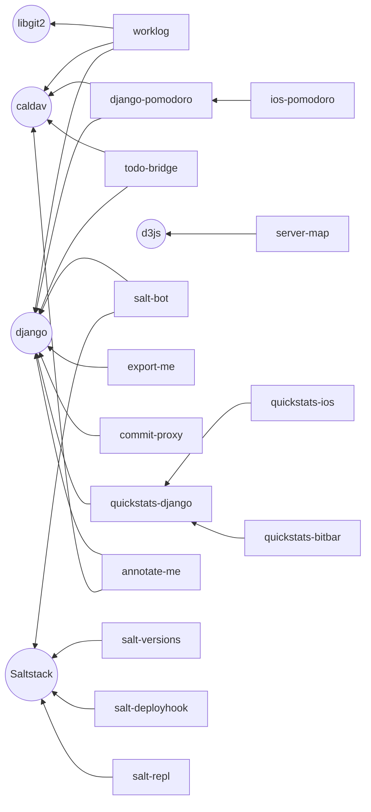

```mermaid
graph RL
worklog-->libgit2((libgit2))
worklog-->caldav((caldav))
django-pomodoro-->caldav
todo-bridge-->caldav
worklog-->django((django))
d3js((d3js))
salt((Saltstack))


django-pomodoro-->django
ios-pomodoro-->django-pomodoro
server-map-->d3js
salt-bot-->django
export-me-->django
todo-bridge-->django

commit-proxy-->django
quickstats-django-->django
quickstats-ios-->quickstats-django
quickstats-bitbar-->quickstats-django
annotate-me-->django
annotate-me-->caldav

salt-versions-->salt
salt-deployhook-->salt
salt-repl-->salt
salt-bot-->salt

click worklog "http://example.com"
click export-me "https://github.com/kfdm/exportme"
click annotate-me "https://github.com/kfdm/annotateme"
click commit-proxy "https://github.com/kfdm/commit-proxy"
```
